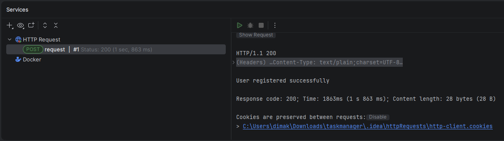

# Registration Backend

Simple REST API project built with Spring Boot and PostgreSQL.

##  Features

- User registration (POST /api/register)
- Get all users (GET /api/users)
- PostgreSQL database integration
- Spring Data JPA
- REST API architecture

##  Tech Stack

- Java
- Spring Boot
- Spring Data JPA
- PostgreSQL
- Maven

##  API Endpoints

### Register user
POST /api/register

```json
{
  "username": "test",
  "password": "123"
}
```
Get users

GET /api/users

## Purpose

This project was built for learning backend development, REST APIs, and database integration.

## How to run
Install PostgreSQL
Create database taskdb
Update application.yml
Run Spring Boot app

## HTTP CLIENT
- request:
- body JSON
- response:
User registered successfully
