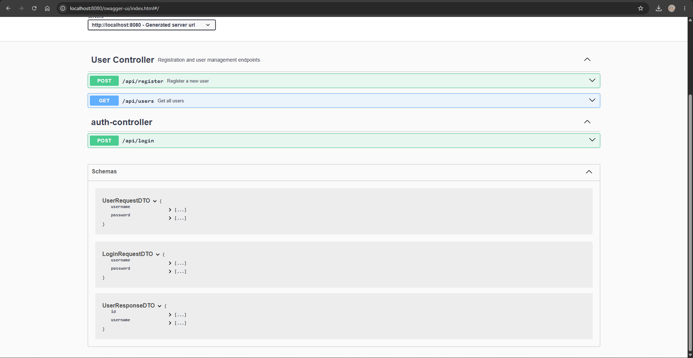
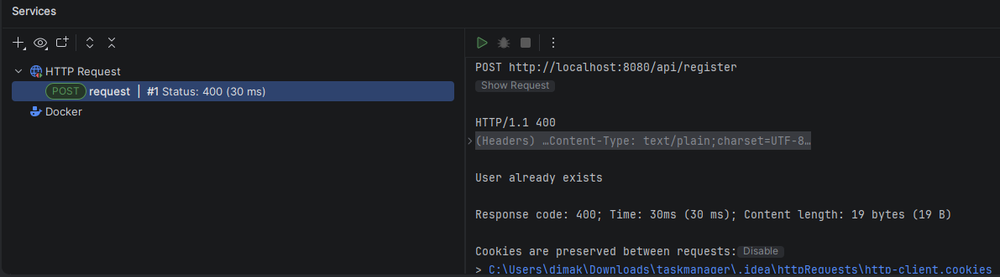
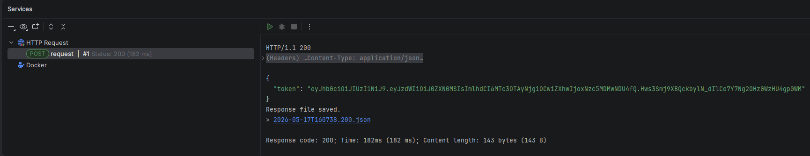
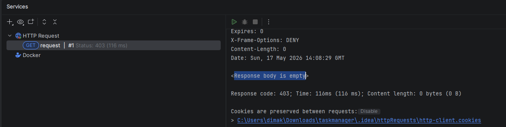

# TaskManager Backend API

A RESTful backend application built with Spring Boot and PostgreSQL.  
The project demonstrates authentication (JWT), layered architecture (DTOs), and API documentation with Swagger.

---

##  Features

- User registration with password encryption (BCrypt)
- User login with JWT authentication
- Get all users (secured endpoint)
- DTO-based architecture (request/response separation)
- Swagger API documentation
- PostgreSQL database integration
- Spring Data JPA
- RESTful API design

---

##  Tech Stack

- Java
- Spring Boot
- Spring Security
- JWT (JSON Web Token)
- Spring Data JPA
- PostgreSQL
- Swagger (springdoc-openapi)
- Maven

---

##  Authentication

After successful login, the API returns a JWT token:

```json
{
  "token": "eyJhbGciOiJIUzI1NiIs..."
}
````

To access protected endpoints, add the token to request headers:

```
Authorization: Bearer YOUR_TOKEN
```

---

## API Endpoints

### Register user

```
POST /api/register
```

Request body:

```json
{
  "username": "test",
  "password": "123"
}
```

---

### Login user

```
POST /api/login
```

Request body:

```json
{
  "username": "test",
  "password": "123"
}
```

Response:

```json
{
  "token": "jwt_token_here"
}
```

---

### Get all users (protected)

```
GET /api/users
```

Requires JWT token.

---

##  Swagger UI

After running the project, open:

```
http://localhost:8080/swagger-ui/index.html
```

You can test all endpoints directly from browser.

---

##  Database Setup

1. Install PostgreSQL
2. Create database:

```sql
CREATE DATABASE taskdb;
```

3. Update `application.yml`:

```yaml
spring:
  datasource:
    url: jdbc:postgresql://localhost:5432/taskdb
    username: postgres
    password: your_password
```

---

## ▶ How to Run

```bash
mvn spring-boot:run
```

or run `TaskmanagerApplication.java` from your IDE.

---

## Architecture

```
controller → dto → service → repository → database
```

---

##  Purpose

This project was built to practice:

* REST API development
* JWT authentication
* Clean architecture with DTOs
* Database integration with PostgreSQL
* API documentation using Swagger

---

## Notes

* Passwords are securely stored using BCrypt hashing
* JWT is used for stateless authentication
* Swagger UI is enabled for API testing
* DTOs are used to separate internal models from API layer

---

## Screenshots

Add screenshots here:

* ### Swagger UI

* ### API responses
Register user:

Login user:

Get all users:

(Response body is empty because there are no users in the database)

---

##  Author

Backend learning project for portfolio and job applications.
